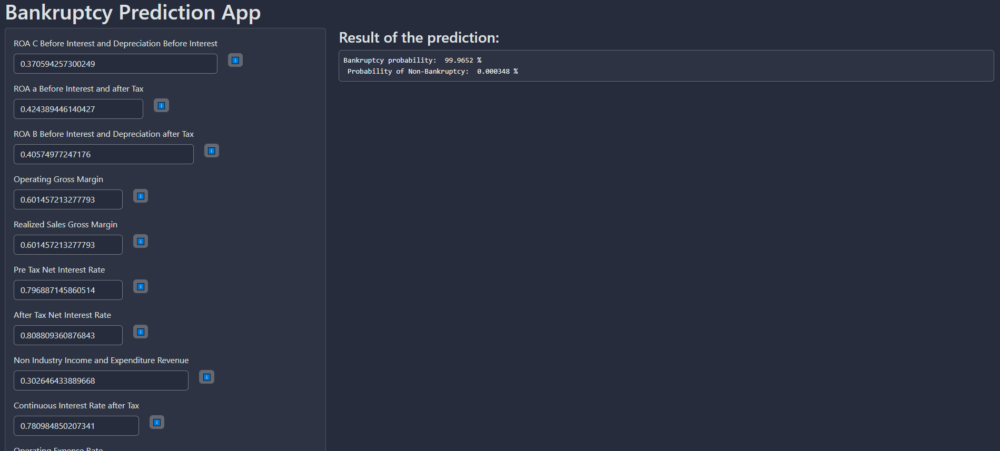

# Bankruptcy-Prediction Web App



This is a Shiny application designed for predicting a company's bankruptcy risk using a pre-trained machine learning model. The app allows users to interactively input financial variables and obtain predictions on whether the company is at risk of bankruptcy.

## Getting Started

### Prerequisites

- R and RStudio installed on your machine.

### Installatio

1. Clone the repositore:

    ```bash
    git clone https://github.com/YourUsername/Bankruptcy-Prediction-App.git

2. Open Rstudio and navigate to the cloned directory

3. Install required packages:

    ```R
    install.packages(c("shiny", "bslib"))

5. Run the app:
    - Open 'App/app.R' in RStudio.
    - Click the "Run App" button.

6. Acces the app in your web browser:
http://127.0.0.1:port

## Project Structure

- App/: Contains the Shiny application files.
- Data/: Contains the dataset files used by the application.
- EDA/: Contains exploratory data analysis scripts and notebooks.
- Graphics/: Stores visualizations and graphs generated during analysis.
- Models/: Holds the pre-trained machine learning model.

## Exploratory Data Analysis (EDA)

The EDA/ directory contains scripts and notebooks used for exploratory data analysis, data preprocessing, and dimensionality reduction. You can find visualizations, histograms, box plots, and other exploratory analyses in the Graphics/ directory.

## Contributing
Contributions are welcome! If you find issues or want to contribute improvements, open a pull request.